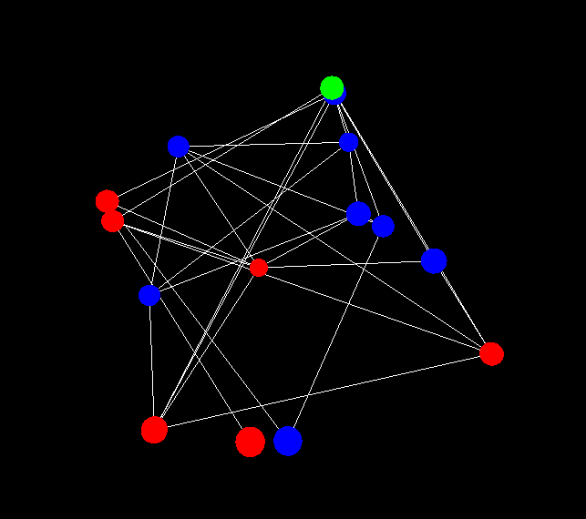

# Complex Network Dynamics Simulator

**Visualização 3D interativa de dinâmica em rede complexa**

---



## 🌐 Visão Geral

O **Complex Network Dynamics Simulator** é uma ferramenta de visualização interativa que permite explorar dinâmicas em redes complexas. Com uma interface 3D intuitiva, você pode observar como diferentes tipos de redes e modelos de atualização influenciam o comportamento do sistema.

---

## ✨ Recursos Principais

- 🕸️ **Dois tipos de rede:**
  - Redes aleatórias (Erdős–Rényi)  
  - Redes contínuas (espaço métrico com condições periódicas)

- 🔄 **Dois modelos de atualização:**
  - Modelo Majority Vote  
  - Modelo Vote Model

- 🎨 **Visualização 3D interativa:**
  - Rotação, zoom e panorâmica  
  - Código de cores para estados dos nós (+1 vermelho, –1 azul)  
  - Nós selecionados destacados em verde

- ⚙️ **Personalização completa:**
  - Número de nós  
  - Magnetização inicial  
  - Grau médio  
  - Nível de ruído  
  - Nós selecionados por passo

- 💾 **Recursos avançados:**
  - Salvar configuração atual  
  - Reinicialização com último estado
  - Captura de telas em sequência (formato PPM)

---

## 📋 Pré-requisitos

- Compilador C (GCC, Clang ou MinGW)  
- Bibliotecas gráficas:
  - OpenGL  
  - GLUT (FreeGLUT)  
- Ferramenta `make` (recomendado)

---

## 🛠️ Instalação

## Windows (MSYS2)
#### Instale o MSYS2: https://www.msys2.org/
#### Abra o terminal MSYS2 MinGW 64-bit
```bash
pacman -Syu
pacman -S --needed mingw-w64-x86_64-toolchain mingw-w64-x86_64-freeglut
git clone https://github.com/seu-usuario/project-network.git
cd project-network
make
make run
```

## Linux (Ubuntu/Debian)
```bash
sudo apt update
sudo apt install build-essential freeglut3-dev libgl1-mesa-dev libglu1-mesa-dev git
git clone https://github.com/seu-usuario/project-network.git
cd project-network
make
./bin/complex-network-sim
```
## Linux (Fedora)
```bash
sudo dnf groupinstall "Development Tools"
sudo dnf install freeglut-devel mesa-libGLU-devel git
git clone https://github.com/seu-usuario/project-network.git
cd project-network
make
./bin/complex-network-sim
```
## macOS
```bash
# Instale Homebrew (caso não tenha)
/bin/bash -c "$(curl -fsSL https://raw.githubusercontent.com/Homebrew/install/HEAD/install.sh)"

# Instale dependências
brew install freeglut git

git clone https://github.com/seu-usuario/project-network.git
cd project-network
make
./bin/complex-network-sim
```

🧪 Compilação Manual (sem Makefile)
```bash
gcc -Wall -Wextra -O3 -Iinclude src/main.c src/network.c src/graphics.c \
    -o bin/complex-network-sim \
    -lglut -lGLU -lGL -lm
```

---

## 🕹️ Como Usar

Ao iniciar o programa, configure os parâmetros:

	Tipo de rede (Aleatória ou Contínua)

	Modelo de atualização (Majority Vote ou Vote Model)

    Número de nós

    Magnetização inicial

    Grau médio 

    Ruído

    Nós selecionados por passo


## 🎮 Controles durante a simulação

| Tecla  | Ação                           |
| ------ | ------------------------------ |
| Espaço | Reiniciar simulação            |
| ESC    | Sair do programa               |
| `+`    | Aumentar velocidade            |
| `-`    | Diminuir velocidade            |
| W      | Zoom in                        |
| S      | Zoom out                       |
| P      | Pausar/retomar simulação       |
| R      | Resetar câmera                 |
| I      | Mostrar informações do sistema |
| Mouse  | Arrastar para rotacionar       |
| Scroll | Zoom                           |

## 📸 Capturas de Tela

Para habilitar captura automática de frames:

    Edite src/graphics.c

    Descomente savePPM(frame); na função idle()

    Frames serão salvos em frr_save/ no formato PPM